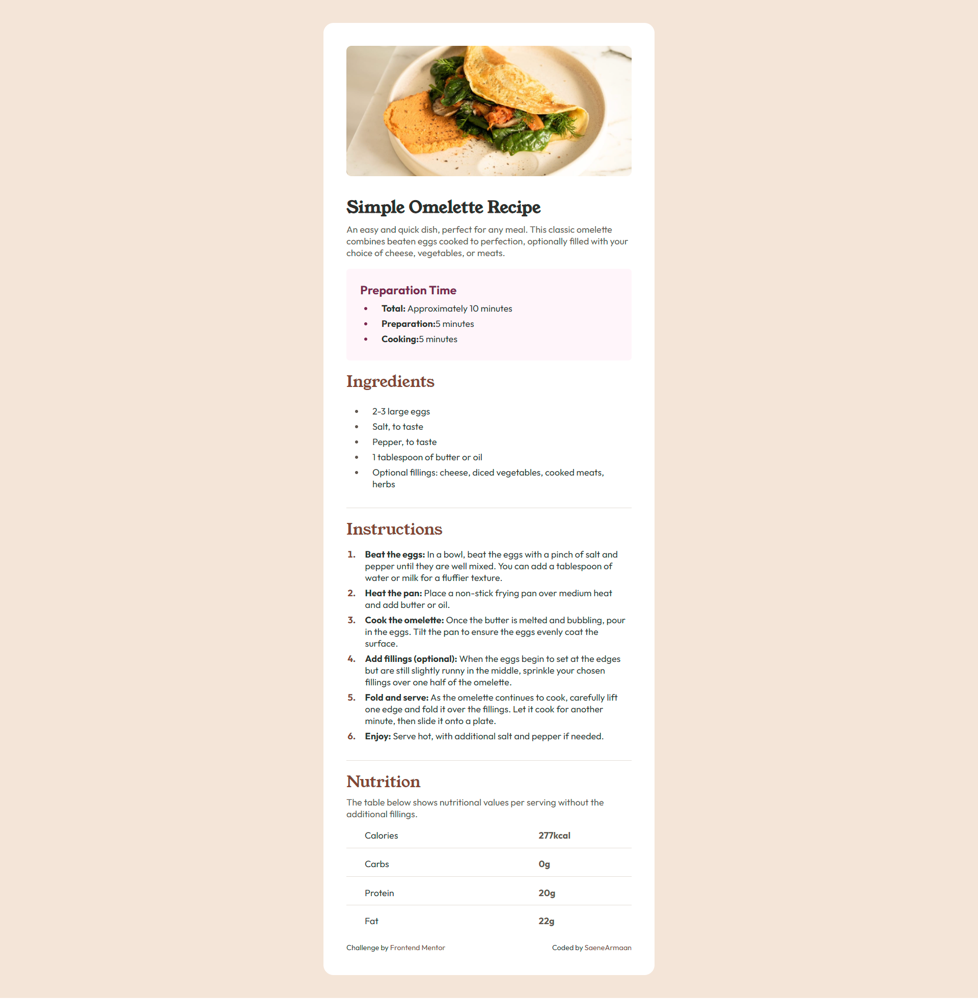

# Frontend Mentor - Recipe page solution

This is a solution to the [Recipe page challenge on Frontend Mentor](https://www.frontendmentor.io/challenges/recipe-page-KiTsR8QQKm). Frontend Mentor challenges help you improve your coding skills by building realistic projects.

## Table of contents

- [The challenge](#the-challenge)
- [Screenshot](#screenshot)
- [Links](#links)
- [Built with](#built-with)
- [What I learned](#what-i-learned)
- [Author](#author)

### Screenshot

### Links

- Solution URL: [Solution](https://github.com/SaeneArmaan/recipe-mainpage)
- Live Site URL: [Live URL](https://recipe-mainpage-saenearmaan.netlify.app)

### Built with

- Semantic HTML5 markup
- CSS custom properties
- Flexbox
- Mobile-first workflow

### What I learned

I have learned how to customize unordered and ordered lists, including changing list styles such as disc, circle, square, and decimal. Additionally, I now know how to modify marker styles, control list positioning, and apply custom styles to enhance the visual presentation of lists.

## Author

- Frontend Mentor - [@SaeneArmaan](https://www.frontendmentor.io/profile/SaeneArmaan)
- Twitter - [@Armaan2Saini](https://x.com/Armaan2Saini)
